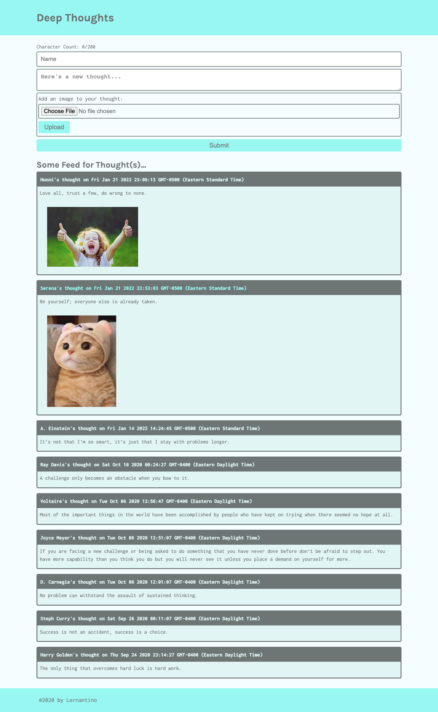

# Deep Thoughts - AWS Integration  

## Description

The Deep Thoughts application, which allows users to post their thoughts along with images. It is built using React, Node.js, Express.js, and DynamoDB web service. This app is deployed to the cloud in an EC2 instance and the back-end API is replaced with cloud resources to handle the storage, database, and computing. 

* Image upload feature: As a user, I want to share images along with my thoughts. As a developer, I captured user images and then upload the image programmatically to an S3 bucket.

* Why DynamoDB? DynamoDB was made with high performance under extreme load conditions in mind. If we use a large-scale-first mentality when designing web applications, we can circumvent the technical debt of database migration by starting with a system that can handle a high request load.

## Built With
* Node.js
* Express.js
* React.js
* Amazon Simple Storage Service (S3)  
* DynamoDB database
* Elastic Compute Cloud (EC2) instance
* NGINX

## Deployed on AWS EC2
<http://52.15.144.59/>

## Contribution
< > with ❤️  by Serena Guo

## Screenshots

